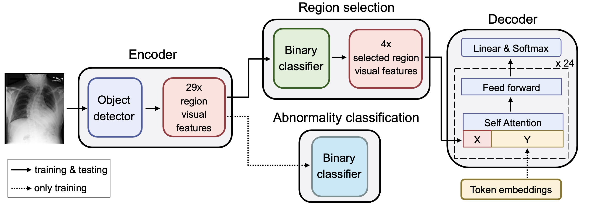
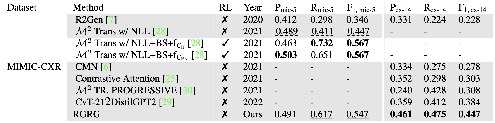
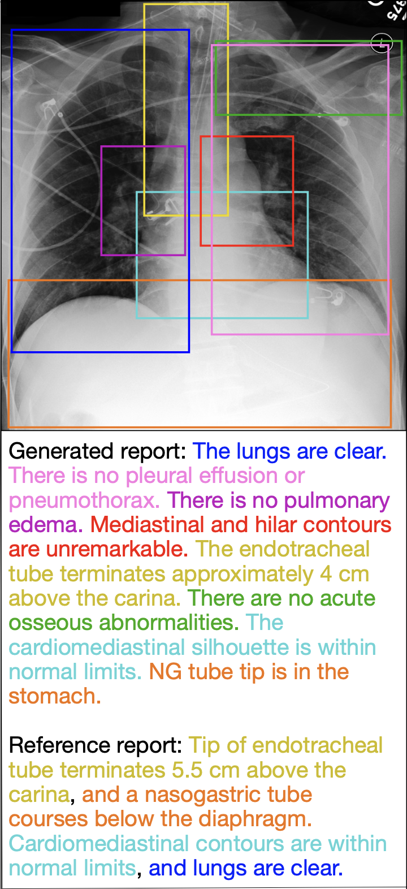
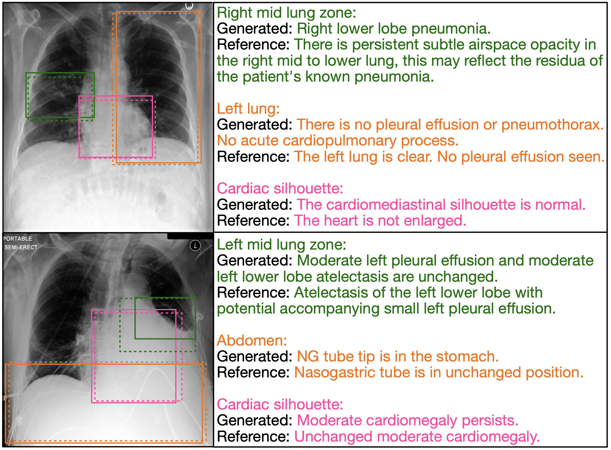
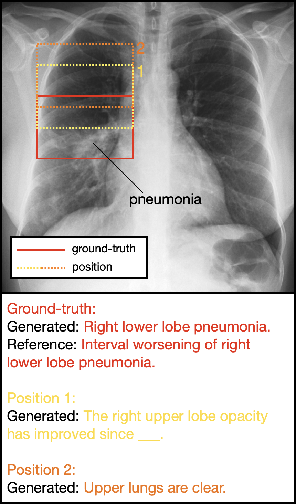

# Interactive and Explainable Region-guided Radiology Report Generation (accepted to CVPR 2023)

## arXiv

https://arxiv.org/abs/2304.08295

## Abstract

The automatic generation of radiology reports has the potential to assist radiologists in the time-consuming task of report writing. Existing methods generate the full report from image-level features, failing to explicitly focus on anatomical regions in the image. We propose a simple yet effective region-guided report generation model that detects anatomical regions and then describes individual, salient regions to form the final report. While previous methods generate reports without the possibility of human intervention and with limited explainability, our method opens up novel clinical use cases through additional interactive capabilities and introduces a high degree of transparency and explainability. Comprehensive experiments demonstrate our method's effectiveness in report generation, outperforming previous state-of-the-art models, and highlight its interactive capabilities.

## Method

 *Figure 1. **R**egion-**G**uided Radiology **R**eport **G**eneration (RGRG): the object detector extracts visual features for 29 unique anatomical regions in the chest. Two subsequent binary classifiers select salient region features for the final report and encode strong abnormal information in the features, respectively. The language model generates sentences for each of the selected regions (in this example 4), forming the final report. For conciseness, residual connections and layer normalizations in the language model are not depicted.*

## Quantitative Results

 *Table 1. Natural language generation (NLG) metrics for the full report generation task. Our model is competitive with or outperforms previous state-of-the-art models on a variety of metrics.*

 *Table 2. Clinical efficacy (CE) metrics micro-averaged over 5 observations (denoted by mic-5) and example-based averaged over 14 observations (denoted by ex-14). RL represents reinforcement learning. Our model outperforms all non-RL models by large margins and is competitive with the two RL-based models directly optimized on CE metrics. Dashed lines highlight the scores of the best non-RL baseline.*

## Qualitative Results

<p align="center">
  
</p>
<p align="left">Figure 2. <b>Full report generation</b> for a test set image. Detected anatomical regions (solid boxes), corresponding generated sentences, and semantically matching reference sentences are colored the same. The generated report mostly captures the information contained in the reference report, as reflected by the matching colors.</p>

<p align="center">
  
</p>
<p align="left">Figure 3. The interactive capability of <b>anatomy-based sentence generation</b> allows for the generation of descriptions for anatomical regions explicitly chosen by the radiologist. We show predicted (dashed boxes) and ground-truth (solid boxes) anatomical regions and color sentences accordingly. We observe that the model generates pertinent, anatomy-related sentences.</p>

<p align="center">
  
</p>
<p align="left">Figure 4. The interactive capability of <b>selection-based sentence generation</b> allows for the generation of descriptions for bounding boxes manually drawn by radiologists. The generated sentences demonstrate heightened sensitivity to bounding box position.</p>

## Setup

1. Create conda environment with "**conda env create -f environment.yml**"
2. Install Java 1.8.0 (required for pycocoevalcap library, see https://pypi.org/project/pycocoevalcap/). On Ubuntu, you can install Java 1.8.0 with "**sudo apt install openjdk-8-jdk**".
3. In [path_datasets_and_weights.py](src/path_datasets_and_weights.py), specify the paths to the various datasets (Chest ImaGenome, MIMIC-CXR, MIMIC-CXR-JPG), CheXbert weights, and folders in which the runs are saved. Follow the instructions of the doc string of path_datasets_and_weights.py.

## Create train, val and test csv files

After the setup, run "**python [create_dataset.py](src/dataset/create_dataset.py)**" to create train, val and test csv files, in which each row contains specific information about a single image. See doc string of create_dataset.py for more details.

As a side note - we cannot provide you these files directly (i.e. you have to create these csv files yourself), since they contain patient information from Chest ImaGenome/MIMIC-CXR, to which only credentialed users with training in handling human participant data should have access (for privacy reasons).

## Training and Testing

Please read [README_TRAIN_TEST.md](README_TRAIN_TEST.md) for specific information on training and testing the model.

## Inference

To generate reports for a list of images, run "**python [generate_reports_for_images.py](src/full_model/generate_reports_for_images.py)**". Specify the model checkpoint, the list of image paths and the path to the txt file with the generated reports in the main function.

## Model checkpoint

You can download the full model checkpoint from this [google drive link](https://drive.google.com/file/d/1rDxqzOhjqydsOrITJrX0Rj1PAdMeP7Wy/view?usp=sharing).

## Citation

```
@inproceedings{tanida2023interactive,
    title={Interactive and Explainable Region-guided Radiology Report Generation},
    author={Tanida, Tim and Müller, Philip and Kaissis, Georgios and Rueckert, Daniel},
    booktitle={CVPR},
    year={2023}
}
```

## Notice

This project includes third-party software components that are subject to their respective licenses, as described in the [NOTICE](NOTICE) file, which provides information about the third-party components used, including their names, licenses, and copyright holders. Please review the NOTICE file before using or distributing this software.

---

If you have any questions, please don't hesitate to open a new issue or contact me via linkedIn: https://www.linkedin.com/in/tim-tanida/
